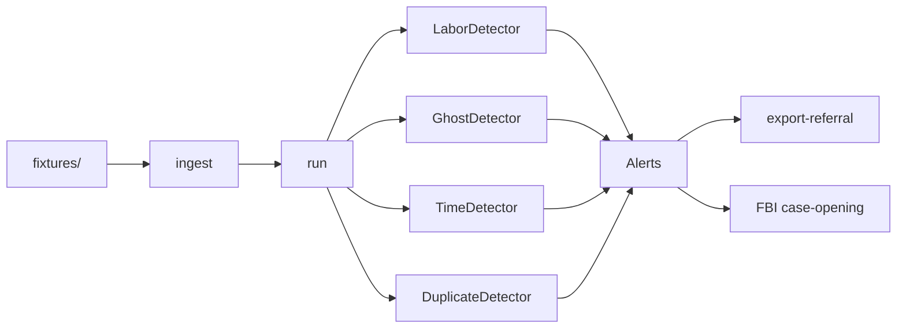

<p align="center">
  
</p>

# whyyoulying

Proactive detection of **Labor Category Fraud** and **Ghost Billing** for DoD IG and FBI fraud investigators.

Per DoDI 5505.02/03, DoD OIG Fraud Scenarios, and Attorney General Guidelines.

Single binary. 6 dependencies. 621 KB. 8 detection rules. 67 unit tests. Zero external services.

---

## Architecture



---

## Supported Platforms

| Target | Arch | Status | Size |
|--------|------|--------|------|
| macOS ARM | aarch64-apple-darwin | Release binary | 621 KB |
| macOS Intel | x86_64-apple-darwin | Release binary | 671 KB |
| Linux x86_64 | x86_64-unknown-linux-gnu | Release binary | 764 KB |
| Android | aarch64-linux-android | AAB (JNI + WebView) | 213 KB |
| Linux ARM64 | aarch64-unknown-linux-gnu | Cross (needs `cross`) | — |
| Linux ARM32 | armv7-unknown-linux-gnueabihf | Cross (needs `cross`) | — |
| Windows x64 | x86_64-pc-windows-gnu | Cross (needs `cross`) | — |
| FreeBSD x64 | x86_64-unknown-freebsd | Cross (needs `cross`) | — |
| RISC-V 64 | riscv64gc-unknown-linux-gnu | Cross (needs `cross`) | — |
| IBM POWER | powerpc64le-unknown-linux-gnu | Cross (needs `cross`) | — |
| iOS | aarch64-apple-ios | Library only | — |
| WebAssembly | wasm32-unknown-unknown | Library only | — |

Build all: `./scripts/build-all-targets.sh`

---

## Quick Start

```bash
# Build
cargo build --release

# Run fraud detection demo (baked-in sample contracts)
cargo run --release -- demo

# Run detection on your own data
cargo run --release -- --data-path fixtures run

# Export FBI case-opening document
cargo run --release -- --data-path fixtures export-referral --fbi

# Print SPDX SBOM
cargo run --release -- --sbom

# Run unit tests (67 tests)
cargo test

# Run integration tests (f49-f60)
cargo run --bin whyyoulying-test --features tests
```

---

## Usage

| Command | Description |
|---------|-------------|
| `run` | Load data, run all detectors, output alerts (default) |
| `ingest` | Load and validate data only |
| `export-referral` | Export GAGAS referral package for DoD IG |
| `export-referral --fbi` | Export FBI case-opening per AG Guidelines |
| `demo` | Run detection on baked-in sample contracts (text, json, or html) |
| `govdocs` | Print federal compliance docs (sbom, fips, cmmc, etc.) |

### Options

| Flag | Description |
|------|-------------|
| `--data-path PATH` | Directory with contracts.json, employees.json, labor_charges.json, billing_records.json |
| `--config PATH` | Config file (labor_variance_threshold_pct, min_confidence) |
| `--threshold PCT` | Labor variance threshold 0-100 (default 15) |
| `--min-confidence 0-100` | Filter alerts below confidence (S4 false-positive control) |
| `--agency AGENCY` | DoD nexus: filter by agency (e.g. DoD, Army) |
| `--cage-code CODE` | DoD nexus: filter by CAGE code |
| `--output json\|csv` | Output format |
| `--sbom` | Print SPDX 2.3 SBOM and exit |

### Exit Codes

- `0` — No alerts
- `1` — Alerts found
- `2` — Error

---

## Data Format

Place JSON files in `--data-path`:

- `contracts.json` — id, cage_code, agency, labor_cats, labor_rates
- `employees.json` — id, quals, labor_cat_min, verified
- `labor_charges.json` — contract_id, employee_id, labor_cat, hours, rate
- `billing_records.json` — contract_id, employee_id, billed_hours, billed_cat, period

See `fixtures/` for examples.

---

## Detection Rules

| Rule | Type | Description |
|------|------|-------------|
| LABOR_VARIANCE | Labor | Labor category not in contract |
| LABOR_QUAL_BELOW | Labor | Employee charged above qualification |
| LABOR_RATE_OVERBILL | Labor | Charged rate exceeds contract rate by > threshold |
| GHOST_NO_EMPLOYEE | Ghost | Billed employee not in roster |
| GHOST_NOT_VERIFIED | Ghost | No floorcheck verification |
| GHOST_BILLED_NOT_PERFORMED | Ghost | Billed hours exceed performed |
| TIME_OVERCHARGE | Ghost | Employee total billed hours exceed max per period |
| DUPLICATE_BILLING | Labor | Same employee billed on 2+ contracts in same period |

---

## Code Metrics

| Metric | Value |
|--------|-------|
| Lines of Rust | 2,603 |
| Source files | 16 |
| Detection rules | 8 |
| Unit tests | 67 |
| Integration tests | 12 (f49-f60) |
| Direct dependencies | 6 (anyhow, clap, serde, serde_json, tempfile, thiserror) |
| Release binary (macOS ARM) | 621 KB |

All public symbols are P13 compressed per [compression_map](docs/compression_map.md).

---

## Docs

- [USER_STORY_ANALYSIS](USER_STORY_ANALYSIS.md) — DoD IG / FBI personas and gap analysis
- [TIMELINE_OF_INVENTION](TIMELINE_OF_INVENTION.md) — Chronological commit record
- [PROOF_OF_ARTIFACTS](PROOF_OF_ARTIFACTS.md) — Verifiable build and test metrics
- [TRIPLE_SIMS_WHYYOULYING](docs/TRIPLE_SIMS_WHYYOULYING.md) — Sim 1-4
- [TRIPLE_SIMS_ARCH](docs/TRIPLE_SIMS_ARCH.md) — Domain model, pipeline
- [TRIPLE_SIMS_STAT](docs/TRIPLE_SIMS_STAT.md) — Test coverage stats
- [protocol_map](docs/protocol_map.md) — Protocol abbreviations
- [compression_map](docs/compression_map.md) — P13 tokenization map

### Federal Compliance (govdocs/)

All compliance docs are baked into the binary and available at runtime via `whyyoulying govdocs <doc>`.

- [SBOM](govdocs/SBOM.md) — Software Bill of Materials (EO 14028)
- [SSDF](govdocs/SSDF.md) — NIST SP 800-218 compliance
- [SECURITY](govdocs/SECURITY.md) — Security posture
- [PRIVACY](govdocs/PRIVACY.md) — Privacy impact assessment
- [FIPS](govdocs/FIPS.md) — FIPS 140-2/3 status
- [CMMC](govdocs/CMMC.md) — CMMC Level 1-2 practices
- [SUPPLY_CHAIN](govdocs/SUPPLY_CHAIN.md) — Supply chain integrity
- [FedRAMP_NOTES](govdocs/FedRAMP_NOTES.md) — FedRAMP applicability
- [ITAR_EAR](govdocs/ITAR_EAR.md) — Export control classification
- [ACCESSIBILITY](govdocs/ACCESSIBILITY.md) — Section 508 compliance
- [FEDERAL_USE_CASES](govdocs/FEDERAL_USE_CASES.md) — Agency use cases

---

Built by [cochranblock.org](https://cochranblock.org) — The Cochran Block. Unlicense (public domain).
